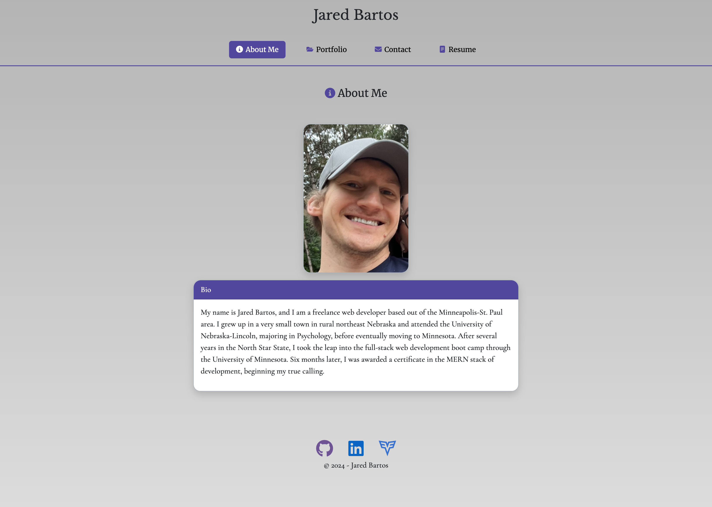
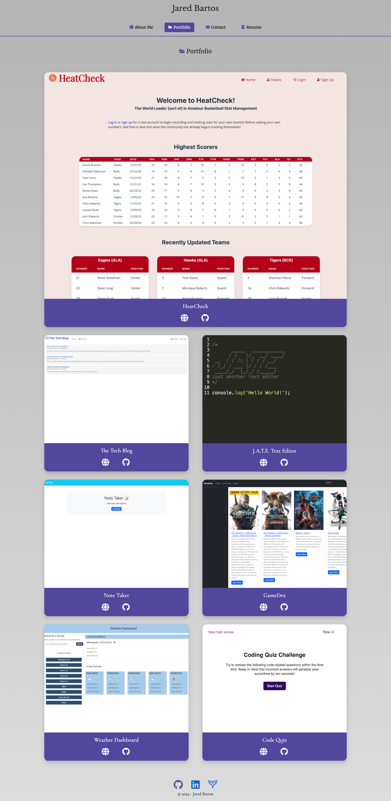
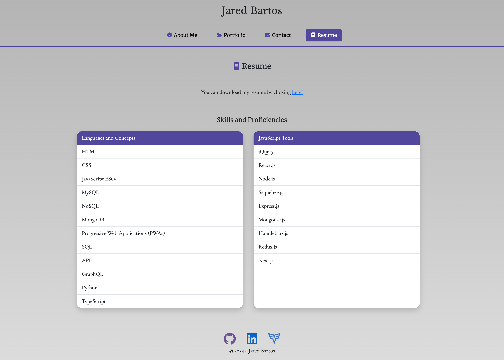

# Portfolio

## Link

[Jared Bartos - Portfolio](https://jaredbartos.netlify.app/)

## Description

This is my portfolio, built using React.js. It contains a short bio and photo of myself, screenshots and links to several of my favorite projects
to date, a contact page to get in touch with me directly, and a resume page that lists my proficiencies as a developer and a download link for a PDF version
of my resume. If you have any interest in collaborating or are looking for an up-and-coming developer to add to your team, visit my portfolio and see what I've got to offer!

## Table of Contents
- [Requirements](#requirements)
- [License](#license)
- [Questions](#questions)
- [Screenshots](#screenshots)

## Requirements

Any Web Browser

## License

This application is covered under MIT License.

Please refer to the LICENSE file in repo for more information.

## Questions

My GitHub profile: https://github.com/jaredbartos

If you have any further questions, please contact me through email.

jaredbartos@gmail.com

## Screenshots

